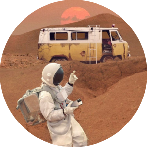
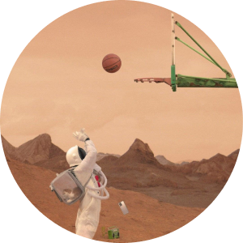

# Branding <!-- omit in toc -->

Our design philosophy describes the principles and values that secure a consistent and unique design identity for Shazam. This is the basis for creating an innovative, functional and consistent music recognition tool.

Our brand reflects who we are and how we want our users to feel when they use our products.

## Table of contents <!-- omit in toc -->
- [Inclusive language](#inclusive-language)
- [Language and grammar](#language-and-grammar)
- [Mission](#mission)
- [Tone of voice](#tone-of-voice)
- [Values](#values)
- [Writing style](#writing-style)

---

## Inclusive language

We don't use words, sentences and tones that reflect stereotypical or discriminatory views about people.  
Treat all people fairly, no matter where they come from or what they do.

### What is inclusive language? <!-- omit in toc -->

Inclusive language is using words and tones that respect everyone and avoid stereotypes or discrimination.  
We prioritize "people-first language". This means focusing on persons, not labels such as gender, race or ability.

### Abilities and disabilities <!-- omit in toc -->

Focus on the person, not their disability.
Don't treat disability as a characteristic of a person.

### Ageism <!-- omit in toc -->

Inclusive language is also sensitive to the entire age range. Terms like "older" and "younger" shouldn't be used in context.  
Avoid terms that limit and categorize. 

### Culture and faith <!-- omit in toc -->

We are a multicultural company, so we should respect cultural values ​​and traditions in our common life.

{: .note } 
Avoid using words related to religion.  
Try not to use language that focuses only on the culture's values and traditions or that creates divisions between different groups.

### Race <!-- omit in toc -->

Avoid emphasizing differences between people. Don't stereotype or make generalizations.

### Sexism <!-- omit in toc -->

Use gender neutral language. Don’t use sexual references.

### Vulgar language <!-- omit in toc -->

Don't use profanity as it may cause offense. If you're referring to song title that contains vulgar language, then use [quote rules](https://asiakostrzewa.github.io/ShazamDesignSystem/docs/Branding.html#quotes-).

## Language and grammar

Apply the following rules to make your content clear, consistent and reliable.

### Abbreviations <!-- omit in toc -->
Don’t use abbreviations in external communications.

{: .warning } 
Don't use SDS, i.e. or e.g.

### Bold <!-- omit in toc -->

Use bold text to draw the reader's attention to key phrases in your content.

### British English <!-- omit in toc -->

Use British English spelling, grammar and punctuation.

### Colons <!-- omit in toc -->

Use colons before a bulleted list or list of steps.

{: .warning } 
Don’t use colons at the end of titles and headings.

### Date and time <!-- omit in toc -->

According to [ISO 8601 standard](https://www.iso.org/iso-8601-date-and-time-format.html){:target="_blank"}, dates are expressed numerically as year, month, day and are separated by a hyphen. Times are expressed on a 24-hour clock. Unless local regulations require otherwise.

{: .warning }
Don’t use slashes in dates: the 3/5/22 format is used in America, which is different from the European standard.

### Exclamation marks <!-- omit in toc -->

Don’t use exclamation marks, unless to highlight something exciting or new. If possible, it's best to stick to at most just one per page.

### Gender <!-- omit in toc -->

Avoid gender-specific pronouns. If necessary, use they/them instead of he/she/her/his.

### Italics <!-- omit in toc -->

Use italics for quotes or when defining a term. Don't use italics to emphasize something instead of bold text.

### Letter case <!-- omit in toc -->

Make all titles, headings and components (such as labels or buttons) case-sensitive. Remember to capitalize Shazam.

### Lists <!-- omit in toc -->

Use lists to help users scan and follow. Use sentences as short as possible. End the sentences with a period or semicolon.

#### Bulleted <!-- omit in toc -->

Use bulleted lists to describe options or when the order of items is not important.

#### Numbered <!-- omit in toc -->

Use numbered lists for steps or when the order of items is important.

### Oxford comma <!-- omit in toc -->

Don't use an Oxford comma before "and" for the last item in a list.

{: .good }
*Only one additional system color can be used with SystemBlack, SystemWhite and SystemGrey per page.*

{: .warning }
*Only one additional system color can be used with SystemBlack, SystemWhite, and SystemGrey per page.*

### Periods <!-- omit in toc -->

Use only one space after a period. Don't use periods in titles, headers, buttons and menu names.

### Quotes <!-- omit in toc -->

Use quotation marks or italics for quotes.

### Sentences <!-- omit in toc -->

Keep your sentences as short and simple as possible to avoid complicated text and complex punctuation.

### Titles and headings <!-- omit in toc -->

Be case-sensitive in titles and headings. Don’t use bold, italics and periods in titles and headings.

### When everything else fails <!-- omit in toc -->

follow the [Apple Style Guide](https://support.apple.com/pl-pl/guide/applestyleguide/welcome/web){:target="_blank"}.

## Mission

"Our mission is to help people recognize and engage with the world around them", that's why we provide a tool that recognizes music around our users. It's the best way to discover, explore and share the music that people love.

We are constantly looking for new and innovative ways to delight our users.

## Tone of voice

As a company, we would like to keep things casual and friendly. If Shazam were a person, they would be up to date with pop culture, funny and not taking themselves too seriously.

Our content covers our values and style. We use clear and plain language to create messages that users know and direct them where they need to go.

## Values

### Discover and explore <!-- omit in toc -->
We give our users everything they need, instantly. Imagine you're riding on a tram or in a car and suddenly you hear a song that makes your day. You want to save it so you can go back to that moment.  
This is what we do.

### One team with the user <!-- omit in toc -->
We would like to be like a good friend who recommends a good music playlist, offers hugs when bad days come and gives energy when the sun rises.  
We simply understand the needs of our user - friend.

### Take the initiative to change <!-- omit in toc -->
At Shazam, we're not afraid of change. We create them to improve our products. Continuous improvement is our responsibility.

## Writing style

Our writing style should reflect our values, mission and tone of voice.

### Be positive and open <!-- omit in toc -->

Focus on details to keep confidence in our products. Maintain a consistent narrative in all our brand communications and across platforms to ensure a great user experience. Assure users that they can explore and expect a reliable experience. Accompany them on their journey and emphasize important features and new functions. 

### Be a superhero <!-- omit in toc -->
Motivate users to use Shazam products. Provide helpful tips to guide users in the right direction. Understand what challenges users need and what they want to achieve. Then give appropriate hints.

### Be professional with a bit of charm <!-- omit in toc -->

Provide enough information to start using our products. Get straight to the point and be direct. Be helpful, but not intrusive. Hint at the exciting possibilities ahead, then step back and observe. Provide clear, useful content and build friendships. Use universally understandable language to ensure inclusivity.
