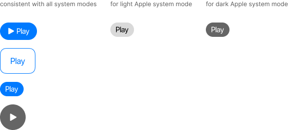

# Components <!-- omit in toc -->

We use components as the visual elements needed to create engaging interactions and usability experiences. 

These guidelines include information how to apply them to achieve product consistency.

## Table of contents <!-- omit in toc -->
- [Button](#button)
- [Card](#card)
- [Colors](#colors)
- [Dates](#dates)
- [Symbols and icons](#symbols-and-icons)
- [Logo](#logo)
- [Toggles](#toggles)
- [Typography](#typography)

---

## Button

Buttons initiate an action when the user clicks, taps or presses. They can be represented as text labels or displayed as icons or images.

Find below the available button combinations that can be used to create call-to-action(s) in Shazam Design System:

### Forward button  <!-- omit in toc -->

Forward button (also Next button) is usually placed on a toolbar or navigation bar and allows users to move forward to the next screen or webpage.
Use the right arrow to this button.

### More button  <!-- omit in toc -->

More button refers to the ellipsis button that opens a menu with additional options.

### Back button  <!-- omit in toc -->

Back button is usually placed on a toolbar or navigation bar and allows users to return to the previous screen or webpage.
Use the left arrow to this button.

### Close button  <!-- omit in toc -->

Close button refers to the rightmost window controls button, located in the upper right corner of the title bar.

## Card

Card is a user interface element that contains information and actions related to a single topic. They allow users to easily discover content and features.

{: .note }
Cards look good on any screen size and resolution, but nevertheless, remember to test their responsiveness.

### Anatomy of card <!-- omit in toc -->

### UI card design principles <!-- omit in toc -->
1. Efficiency - cards contain only necessary information and actions;
2. Meaningfulness – cards contain information that helps the users make a decision;
3. Clarity - content of the card should have a clear visual hierarchy;
4. Independence - card should be self-contained;
5. Responsiveness - cards can resize to fit the available space.

{: .good } 
Use cards for dashboards, menu options and items that can best be perceived visually.

{: .warning } 
Don't use cards when content should be sorted or filtered.

### Rules in the card UI <!-- omit in toc -->
1. **Use appropriate image** to represent the card's theme.
2. **Prioritize text information** by limiting its content to the necessary minimum. Also, avoid scrolling the text on the card.
3. **Give clear call-to-action(s)**. If needed, you can use the primary and secondary buttons to help users make decisions.  

4. **Use simple fonts**. Our SF Pro Display sans-serif font meets this principle.
5. **Design responsive cards**. Available types of responsible cards:

## Colors

Colors are a powerful design element - they trigger a wide range of thoughts and feelings.  
That's why the colors shown here are the only ones that may be used when communicating the Shazam brand.

### Primary colors <!-- omit in toc -->

Primary colors are the most strategic for our brand and should be used most often.  
Shazam SystemBlue signals discovery, reliability and confidence. Together with SystemWhite, which is a visual enhancer - the primary colors should be used to recognize the Shazam brand.

| SystemBlue| SystemWhite |
| :-----------: | :-----------: |
|   |        |
| HEX #007AFF  | HEX #FFFFFF        |

### Secondary colors <!-- omit in toc -->

Secondary colors should be used for subtle decorative purposes.  
Gray tone shows strength, stability and patience.  
Light blue signals freshness, reliability and youth.

| SystemBlack | SystemGrey | SystemCyan |
| :-----------: | :-----------: | :-----------: |
|   |        |        |
| HEX #000000 | HEX #5B5B5B | HEX #4DCDFF |

### System colors <!-- omit in toc -->

System colors have been designed to highlight a specific message or element. These colors should be used sparingly and only one color at a time due to their strength.

| SystemRed | SystemOrange | SystemYellow | SystemGreen | SystemMint |
| :-----------: | :-----------: | :-----------: | :-----------: | :-----------: | 
|   |        |        |        |        |
| HEX #FF3B30 | HEX #FF9500 | HEX #FFCC00 | HEX #34C759 | HEX #00C7BE |

| SystemTeal | SystemIndigo | SystemPurple | SystemPink | SystemBrown |
| :-----------: | :-----------: | :-----------: | :-----------: | :-----------: | 
|   |        |        |        |        |
| HEX #30B0C7 | HEX #5856D6 | HEX #AF52DE | HEX #FF2D55 | HEX #A2845E |

{: .note }
Note that only one system color can be used at a time.  
Never mix system colors. Only one additional system color can be used with SystemBlack, SystemWhite and SystemGrey per page.

{: .warning }
Don’t use color to convey positive or negative qualities.  
Avoid assigning good and bad values to colors (for example: a blacklist or a white hat hacker) or using colors as metaphors to convey larger concepts. Use colors only to describe actual colors (for example: black text on a white background).

### System backgrounds <!-- omit in toc -->

Background colors must not disturb the user in receiving information. They must be simple and have an appropriate color contrast with the content components.  
Shazam uses light and dark Apple system modes.

| SystemBlack| SystemWhite |
| :-----------: | :-----------: |
|   |        |
| HEX #000000 | HEX #FFFFFF        |

{: .warning }
Never use system colors as a backgrounds.

## Dates

According to [International Organization for Standardization (ISO)](https://www.iso.org){:target="_blank"}, ISO 8601 standard, dates are expressed numerically as year, month, day and are separated by a hyphen. Times are expressed on a 24-hour clock.

Use the date component from [Apple Design Resources](https://developer.apple.com/design/resources/){:target="_blank"} for Shazam app:

{: .warning }
Don’t use slashes in dates: the form 3/5/22 is used in America, which is different from the European one.

## Symbols and icons

Symbols and icons are screen graphics that represents another item. Used in Shazam applications must be clear and recognizable.

App navigation symbols and action buttons are built based on the [Apple Design Resources](https://developer.apple.com/design/resources/){:target="_blank"} and [Apple SF Symbols](https://developer.apple.com/sf-symbols/){:target="_blank"}.

### Rules in symbols and icons UI <!-- omit in toc -->
- Symbols and icons are always two-dimensional;
- Only use well-known symbols and icons that are recognized by many;
- Use the same symbol or icon for common or related purposes;
- Use symbols and icons sparingly so as not to lose their effect in context;
- Use rounded corners and oval shapes based on the lettering style of the Shazam wordmark.

### Variants <!-- omit in toc -->

Use symbols and icons depending on the colors of the system mode variants.

For symbols and icons, use colors such as SystemBlue, SystemWhite and SystemGrey.

### Shapes alignment <!-- omit in toc -->
Shapes of symbols and icons are based on a 1x1 px grid. Use these basic shapes as a baseline to maintain consistent visual proportions of the icons.

{: .warning } 
Don't use straight corners and lines with slanted ends.  
Don't use shadows.  
Don't fill in large areas, only fill in details for clarity.

{: .good } 
Keep a consistent form of symbols and icons.

## Logo

A logo is a visual representation of our brand. It can be a word mark, an icon, or a combination of both. 

The goal is always to proudly project our brand, but without overdoing it. So when the users see our products, they immediately recognize our brand.

#### Logo options <!-- omit in toc -->

The Shazam logo is available in two colors: blue and gray. The blue version is dedicated to a light theme. The gray version should be used on dark theme.

| Light theme logo icons | Dark theme logo icons |
| :-----------: | :-----------: |
|  |  |
|  |  |

## Toggles

The object that users slide to turn the feature on or off.
Depending on the context, users may click, tap or drag a toggle.

{: .warning }
Don’t use the name "*toggle*" in user materials. The toggle is used for internal purposes only.

{: .good }
Use "*turn on/off*" or "*switch between*" instead of "*toggle*".

## Typography

Follow this section for detailed guidelines on application of the different size, weight and color options.

SF Pro Display is a sans-serif font that is modern and provides clear and easy reading in all different weight options.

### Weights <!-- omit in toc -->
There are specific rules about what weights should be used and where they fit.

SF Pro is available in a variety of weights to suit different applications. Make sure to place your text and use spacing and kerning to ensure uninterrupted readability and clarity.

#### Large title <!-- omit in toc -->
The Large title should be set in: 
- SF Pro Display Regular
- SF Pro Display Bold

|       | xSmall | Small | Medium | Large | xLarge | xxLarge | xxxLarge |
| ----------- | ----------- | ----------- | ----------- | ----------- | ----------- | ----------- | ----------- |
| Font size   | 31 pt       | 32 pt      | 33 pt       | 34 pt       | 36 pt       | 38 pt       | 40 pt       |
| Line spacing   | 38 pt        | 39 pt        | 40 pt        | 41 pt        | 43 pt        | 46 pt        | 48 pt        |

Accessibility sizes

|       | AX1 | AX2 | AX3 | AX4 | AX5 |
| ----------- | ----------- | ----------- | ----------- | ----------- | ----------- |
| Font size   | 44 pt       | 48 pt      | 52 pt       | 56 pt       | 60 pt       |
| Line spacing   | 52 pt        | 57 pt        | 61 pt        | 66 pt        | 70 pt        |

#### Title 1 <!-- omit in toc -->
The Title 1 should be set in: 
- SF Pro Display Regular
- SF Pro Display Bold

|       | xSmall | Small | Medium | Large | xLarge | xxLarge | xxxLarge |
| ----------- | ----------- | ----------- | ----------- | ----------- | ----------- | ----------- | ----------- |
| Font size   | 25 pt       | 26 pt      | 27 pt       | 28 pt       | 30 pt       | 32 pt       | 34 pt       |
| Line spacing   | 31 pt        | 32 pt        | 33 pt        | 34 pt        | 36 pt        | 39 pt        | 41 pt        |

Accessibility sizes

|       | AX1 | AX2 | AX3 | AX4 | AX5 |
| ----------- | ----------- | ----------- | ----------- | ----------- | ----------- |
| Font size   | 38 pt       | 43 pt      | 48 pt       | 53 pt       | 58 pt       |
| Line spacing   | 46 pt        | 51 pt        | 57 pt        | 62 pt        | 68 pt        |

#### Title 2 <!-- omit in toc -->
The Title 2 should be set in: 
- SF Pro Display Regular
- SF Pro Display Bold

|       | xSmall | Small | Medium | Large | xLarge | xxLarge | xxxLarge |
| ----------- | ----------- | ----------- | ----------- | ----------- | ----------- | ----------- | ----------- |
| Font size   | 19 pt       | 20 pt      | 21 pt       | 22 pt       | 24 pt       | 26 pt       | 28 pt       |
| Line spacing   | 23 pt        | 24 pt        | 28 pt        | 28 pt        | 30 pt        | 32 pt        | 34 pt        |

Accessibility sizes

|       | AX1 | AX2 | AX3 | AX4 | AX5 |
| ----------- | ----------- | ----------- | ----------- | ----------- | ----------- |
| Font size   | 34 pt       | 43 pt      | 44 pt       | 50 pt       | 56 pt       |
| Line spacing   | 41 pt        | 51 pt        | 52 pt        | 59 pt        | 66 pt        |

#### Title 3 <!-- omit in toc -->
The Title 3 should be set in: 
- SF Pro Display Regular
- SF Pro Display Semibold

|       | xSmall | Small | Medium | Large | xLarge | xxLarge | xxxLarge |
| ----------- | ----------- | ----------- | ----------- | ----------- | ----------- | ----------- | ----------- |
| Font size   | 17 pt       | 18 pt      | 19 pt       | 20 pt       | 22 pt       | 24 pt       | 26 pt       |
| Line spacing   | 22 pt        | 23 pt        | 24 pt        | 25 pt        | 28 pt        | 30 pt        | 32 pt        |

Accessibility sizes

|       | AX1 | AX2 | AX3 | AX4 | AX5 |
| ----------- | ----------- | ----------- | ----------- | ----------- | ----------- |
| Font size   | 31 pt       | 37 pt      | 43 pt       | 43 pt       | 55 pt       |
| Line spacing   | 38 pt        | 44 pt        | 51 pt        | 51 pt        | 65 pt        |

#### Headline <!-- omit in toc -->
The Headline should be set in: 
- SF Pro Display Semibold
- SF Pro Display Semibold Italic

|       | xSmall | Small | Medium | Large | xLarge | xxLarge | xxxLarge |
| ----------- | ----------- | ----------- | ----------- | ----------- | ----------- | ----------- | ----------- |
| Font size   | 14 pt       | 15 pt      | 16 pt       | 17 pt       | 19 pt       | 21 pt       | 23 pt       |
| Line spacing   | 19 pt        | 20 pt        | 21 pt        | 22 pt        | 24 pt        | 26 pt        | 29 pt        |

Accessibility sizes

|       | AX1 | AX2 | AX3 | AX4 | AX5 |
| ----------- | ----------- | ----------- | ----------- | ----------- | ----------- |
| Font size   | 28 pt       | 33 pt      | 40 pt       | 47 pt       | 53 pt       |
| Line spacing   | 34 pt        | 40 pt        | 48 pt        | 56 pt        | 62 pt        |

#### Body <!-- omit in toc -->
The Body should be set in: 
- SF Pro Display Regular
- SF Pro Display Semibold
- SF Pro Display Regular Italic
- SF Pro Display Semibold Italic

|       | xSmall | Small | Medium | Large | xLarge | xxLarge | xxxLarge |
| ----------- | ----------- | ----------- | ----------- | ----------- | ----------- | ----------- | ----------- |
| Font size   | 14 pt       | 15 pt      | 16 pt       | 17 pt       | 19 pt       | 21 pt       | 23 pt       |
| Line spacing   | 19 pt        | 20 pt        | 21 pt        | 22 pt        | 24 pt        | 26 pt        | 29 pt        |

Accessibility sizes

|       | AX1 | AX2 | AX3 | AX4 | AX5 |
| ----------- | ----------- | ----------- | ----------- | ----------- | ----------- |
| Font size   | 28 pt       | 33 pt      | 40 pt       | 47 pt       | 53 pt       |
| Line spacing   | 34 pt        | 40 pt        | 48 pt        | 56 pt        | 62 pt        |

#### Callout <!-- omit in toc -->
The Callout should be set in: 
- SF Pro Display Regular
- SF Pro Display Semibold
- SF Pro Display Regular Italic
- SF Pro Display Semibold Italic

|       | xSmall | Small | Medium | Large | xLarge | xxLarge | xxxLarge |
| ----------- | ----------- | ----------- | ----------- | ----------- | ----------- | ----------- | ----------- |
| Font size   | 13 pt       | 14 pt      | 15 pt       | 16 pt       | 18 pt       | 20 pt       | 22 pt       |
| Line spacing   | 18 pt        | 19 pt        | 20 pt        | 21 pt        | 23 pt        | 24 pt        | 28 pt        |

Accessibility sizes

|       | AX1 | AX2 | AX3 | AX4 | AX5 |
| ----------- | ----------- | ----------- | ----------- | ----------- | ----------- |
| Font size   | 26 pt       | 32 pt      | 38 pt       | 44 pt       | 51 pt       |
| Line spacing   | 32 pt        | 39 pt        | 46 pt        | 52 pt        | 60 pt        |

#### Subheadline <!-- omit in toc -->
The Subheadline should be set in:
- SF Pro Display Regular
- SF Pro Display Semibold
- SF Pro Display Regular Italic
- SF Pro Display Semibold Italic

|       | xSmall | Small | Medium | Large | xLarge | xxLarge | xxxLarge |
| ----------- | ----------- | ----------- | ----------- | ----------- | ----------- | ----------- | ----------- |
| Font size   | 12 pt       | 13 pt      | 14 pt       | 15 pt       | 17 pt       | 19 pt       | 21 pt       |
| Line spacing   | 16 pt        | 18 pt        | 19 pt        | 20 pt        | 22 pt        | 24 pt        | 28 pt        |

Accessibility sizes

|       | AX1 | AX2 | AX3 | AX4 | AX5 |
| ----------- | ----------- | ----------- | ----------- | ----------- | ----------- |
| Font size   | 25 pt       | 30 pt      | 36 pt       | 42 pt       | 49 pt       |
| Line spacing   | 31 pt        | 37 pt        | 43 pt        | 50 pt        | 58 pt        |

#### Footnote <!-- omit in toc -->
The Footnote should be set in:
- SF Pro Display Regular
- SF Pro Display Semibold
- SF Pro Display Regular Italic
- SF Pro Display Semibold Italic

|       | xSmall | Small | Medium | Large | xLarge | xxLarge | xxxLarge |
| ----------- | ----------- | ----------- | ----------- | ----------- | ----------- | ----------- | ----------- |
| Font size   | 12 pt       | 12 pt      | 12 pt       | 13 pt       | 15 pt       | 17 pt       | 19 pt       |
| Line spacing   | 16 pt        | 16 pt        | 16 pt        | 18 pt        | 20 pt        | 22 pt        | 24 pt        |

Accessibility sizes

|       | AX1 | AX2 | AX3 | AX4 | AX5 |
| ----------- | ----------- | ----------- | ----------- | ----------- | ----------- |
| Font size   | 23 pt       | 27 pt      | 33 pt       | 38 pt       | 44 pt       |
| Line spacing   | 29 pt        | 33 pt        | 40 pt        | 46 pt        | 52 pt        |

#### Caption 1 <!-- omit in toc -->
The Caption 1 should be set in:
- SF Pro Display Regular
- SF Pro Display Medium
- SF Pro Display Regular Italic
- SF Pro Display Medium Italic

|       | xSmall | Small | Medium | Large | xLarge | xxLarge | xxxLarge |
| ----------- | ----------- | ----------- | ----------- | ----------- | ----------- | ----------- | ----------- |
| Font size   | 11 pt       | 11 pt      | 11 pt       | 12 pt       | 14 pt       | 16 pt       | 18 pt       |
| Line spacing   | 13 pt        | 13 pt        | 13 pt        | 16 pt        | 19 pt        | 21 pt        | 23 pt        |

Accessibility sizes

|       | AX1 | AX2 | AX3 | AX4 | AX5 |
| ----------- | ----------- | ----------- | ----------- | ----------- | ----------- |
| Font size   | 22 pt       | 26 pt      | 32 pt       | 37 pt       | 43 pt       |
| Line spacing   | 28 pt        | 32 pt        | 39 pt        | 44 pt        | 51 pt        |

#### Caption 2 <!-- omit in toc -->
The Caption 2 should be set in:
- SF Pro Display Regular
- SF Pro Display Semibold
- SF Pro Display Regular Italic
- SF Pro Display Semibold Italic

|       | xSmall | Small | Medium | Large | xLarge | xxLarge | xxxLarge |
| ----------- | ----------- | ----------- | ----------- | ----------- | ----------- | ----------- | ----------- |
| Font size   | 11 pt       | 11 pt      | 11 pt       | 11 pt       | 13 pt       | 15 pt       | 17 pt       |
| Line spacing   | 13 pt        | 13 pt        | 13 pt        | 13 pt        | 18 pt        | 20 pt        | 22 pt        |

Accessibility sizes

|       | AX1 | AX2 | AX3 | AX4 | AX5 |
| ----------- | ----------- | ----------- | ----------- | ----------- | ----------- |
| Font size   | 20 pt       | 24 pt      | 29 pt       | 34 pt       | 40 pt       |
| Line spacing   | 25 pt        | 30 pt        | 35 pt        | 41 pt        | 48 pt        |

### Font colors <!-- omit in toc -->

Rules for combining our brand colors with our brand fonts depend largely on the background color.

See [System backgrounds](https://asiakostrzewa.github.io/ShazamDesignSystem/docs/Components.html#system-backgrounds) and [System colors](https://asiakostrzewa.github.io/ShazamDesignSystem/docs/Components.html#system-colors).

The tables below describe the acceptable font style and color - depending on the background color:

- for light system background:  

|       | System color |
| ----------- | ----------- |
| Large Title, Title 1, Title 2, Title 3, Headline  |        |
| Body, Subhead, Footnote, Caption 1, Caption 2   |         |
| Callout   |         |

- for dark system background:

|       | System color |
| ----------- | ----------- |
| Large Title, Title 1, Title 2, Title 3, Headline  |        |
| Body, Subhead, Footnote, Caption 1, Caption 2   |         |
| Callout   |         |

{: .note }
There are specific rules for combining color and typography.  
System colors should be used sparingly.

{: .warning }
Never use system colors for text in an image.  
Never mix system colors. Only one additional system color can be used with SystemBlack, SystemWhite and SystemGrey per page.