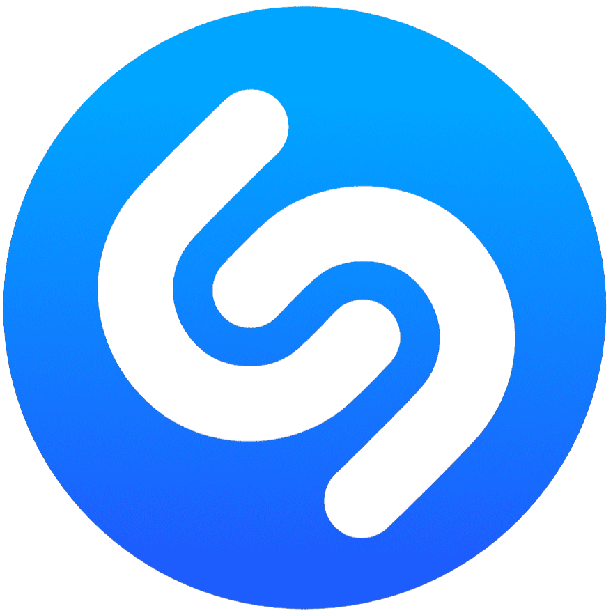
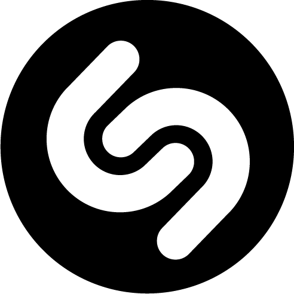

# Components
{: .no_toc }

We use components as the visual elements needed to create engaging interactions and usability experiences. 

These guidelines include information how to apply them to achieve product consistency.

## Table of contents
{: .no_toc .text-delta }

1. TOC
{:toc}

---

## Accessibility

## Button

## Card

## Colors

## Date and time

## Icons

## Logo

A logo is a visual representation of our brand. It can be a word mark, an icon, or a combination of both. 

The goal is always to proudly project our brand, but without overdoing it. So when the users see our products, they immediately recognize our brand.

#### Logo options

The Shazam logo is available in two colors: blue and gray. The blue version is dedicated to a light theme. The gray version should be used on dark theme.

| Light theme logo icons | Dark theme logo icons |
| ----------- | ----------- |
|  |  |
|  |  |

## Multivariant select

## Notification

## Status messages 

error, info, success, warning

## Toggles

switch on and switch off
iOS switch checkbox 

## Typography
 
NeueMontreal - to check