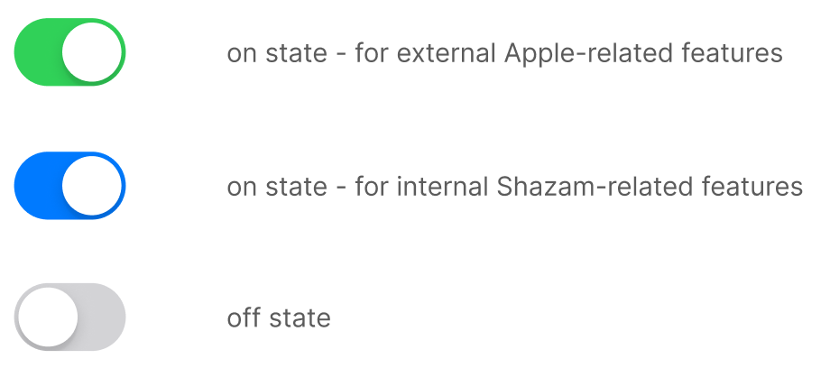

### Toggles

The object that users slide to turn the feature on or off.
Depending on the context, users may click, tap or drag a toggle.

{: .warning }
**DON'T**  
Don’t use the name "*toggle*" in user materials. The toggle is used for internal purposes only.

{: .important }
**DO**  
Use "*turn on/off*" or "*switch between*" instead of "*toggle*".